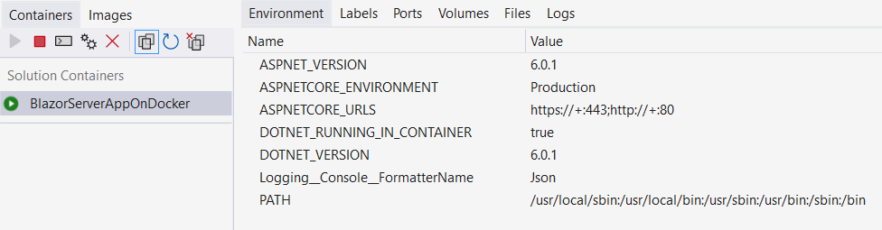
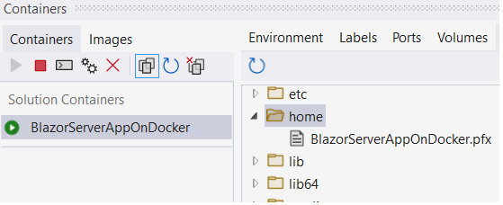
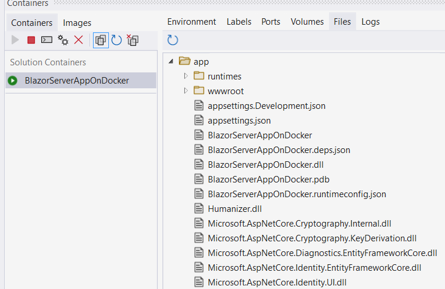

Tutorial can be found [Here](https://zntoyn.com/system-argumentexception-the-path-must-be-absolute/) 

# Blazor Server Running On Docker Linux
	1. Download and open the app
	2. Right click on docker-compose and choose Set As Startup Project
	3. From Solution configurations : choose Debug
	
	
	- System
	.Net core 6
	Mode : Production
	Solution configurations : release not Debug
	OS : Windows 10 + Docker Desktop
	Docker : docker-compose

# On Production
	
	Kestrel is used with certificate
	

